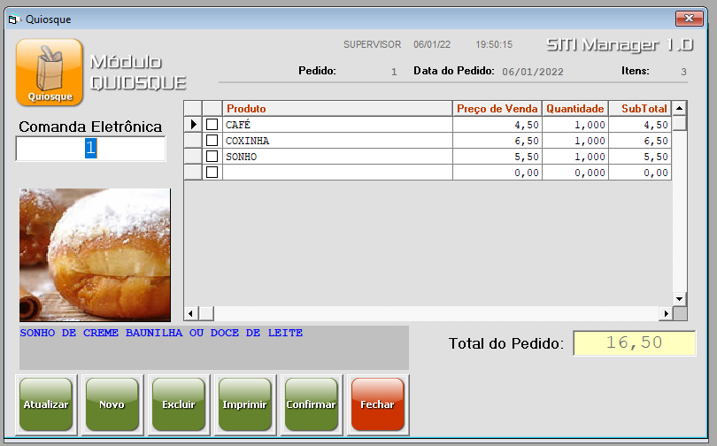

# SITI Manager
### Gerenciador Comercial

Licença de uso temporário - 30 dias após ativação do produto.

### Status do Projeto
Status: Descontinuado.

Projeto acadêmico foi concluído e entregue em sua versão única em 26 de setembro de 2009.

## Protótipo Modelo de Software – SITI Manager
Com a finalidade de apresentar a implementação de uma ou mais tecnologias. Atende ao projeto integrador apresentado na conclusão do curso de bacharelado em Gestão em Tecnologia e Sistemas da Informação.

### Descrição Geral
O estabelecimento não possui um sistema informatizado que realizasse o controle de estoque, estimativa de vendas e relatórios para facilitar o gerenciamento dos negócios facilitando a tomada de decisões.
Para atender a demanda de clientes e aumentar o faturamento o estabelecimento precisava de um controle confiável rápido e seguro.

### Representação Operacional
O cliente necessita de um Software para cadastros referente a produtos, funcionários, fornecedores, e controle de vendas para viabilizar uma melhor administração da empresa permitindo que a rotina do usuário seja simplificada; o programa traz uma interface simples, tornando fácil a sua utilização.

### Requisitos de Implementação
O Software foi desenvolvido com o propósito de viabilizar uma melhor administração no gerenciamento de estabelecimentos comerciais tornando a rotina do usuário simplificada. O programa traz uma interface simples o que torna fácil de utilizá-la. 

O programa busca agregar uma maior interação da empresa com os seus clientes, qualificando o relacionamento entre ambos. Além disso, torna mais fácil a comunicação e a organização das informações através da automatização.

Todas essas vantagens do sistema contam com a segurança oferecida pela estabilidade do software (desenvolvido utilizando o Visual Basic 6.0 e banco de dados Microsoft Office Access). A tecnologia oferecida, embora ao seu tempo, encontra-se em descontinuidade, seguimos com a implementação para demonstrar a capacidade de implementar uma solução com uma tecnologia que atenda e esteja em conformidade com a real necessidade do cliente e considerando as eventuais limitações.

#### Layout
<table>
  <tr>
    <td>
      
    </td>
    <td>
      
    </td>
  </tr>
  <tr>
    <td>
      
    </td>
    <td>
      
    </td>
  </tr>
</table>

### Tecnologias
A aplicação foi desenvolvida utilizando desenvolvimento em GeneXus em sua versão 8.0 para plataforma Microsoft Windows. 
Compilação em Microsoft Visual Basic 6 e armazenamento de dados em Microsoft Access.
Relatórios gerados em Microsoft Excel (xls e xml).

- [GeneXus](https://www.genexus.com/)

### Funcionalidades
- [x] Módulos: Caixa, Quiosque, Estoque, Usuários, Relatórios, Comandas
- [x] Cadastro de fornecedor
- [x] Cadastro de forma de pagamento
- [x] Cadastro de produto
- [x] Cadastro de produto derivado
- [x] Grupo de produtos
- [x] Unidade de produtos
- [x] Entrada / Saída digitada de produtos com NF
- [x] Troca de sessão do usuário no mesmo terminal
- [x] Parametrização do cumpom não fiscal
- [x] Gestão do pedido
- [x] Operação de caixa / abertura, fechamento e sangria
- [x] Cópia de segurança / Restauração de segurança
- [x] Atualização online
- [x] Envio de Feedback ao fabricante de software
- [x] Exportar dados em formato xls (requer uso do Microsot Excel)
- [x] Importar dados em formato xls (requer uso do Microsot Excel)
- [x] Atualização do sistema com importação dados XML - uso com suporte técnico
- [x] Licença de uso para terminais em rede

### Autor

#### Integrantes
Os integrantes do grupo do projeto integrador são:
- Alex Ramos
- Eduardo Elman
- Fernando Rodrigues
- Tiago Julião da Costa
- Wanderson Ricardo

